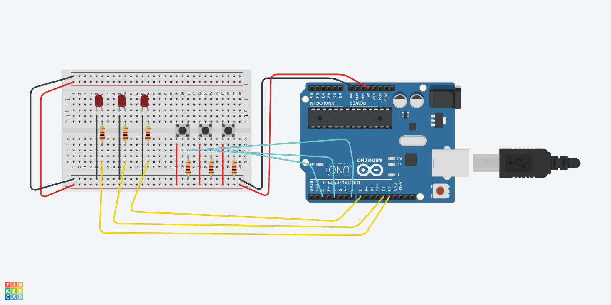

# Arduino-LED-Button-Control
This project is about using Arduino with three leds and three buttons
Each button controls one LED 
**The components Used**
1. ArduinonUNO
2. 3 buttons
3. 3 LEDs
4. 3  resistors for LEDs, 3  resistors for buttons
5. Breadboard
6. Wires

